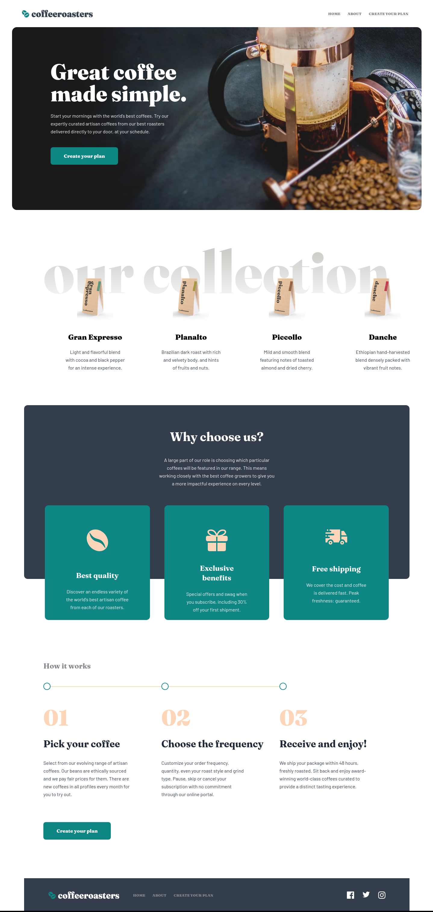

# Frontend Mentor - Coffeeroasters subscription site solution

This is a solution to the [Coffeeroasters subscription site challenge on Frontend Mentor](https://www.frontendmentor.io/challenges/coffeeroasters-subscription-site-5Fc26HVY6). Frontend Mentor challenges help you improve your coding skills by building realistic projects.

## Table of contents

- [Overview](#overview)
  - [The challenge](#the-challenge)
  - [Screenshot](#screenshot)
  - [Links](#links)
- [My process](#my-process)
  - [Built with](#built-with)
  - [What I learned](#what-i-learned)
  - [Continued development](#continued-development)
  - [Useful resources](#useful-resources)
- [Author](#author)
- [Acknowledgments](#acknowledgments)

## Overview

### The challenge

Users should be able to:

- View the optimal layout for each page depending on their device's screen size
- See hover states for all interactive elements throughout the site
- Make selections to create a coffee subscription and see an order summary modal of their choices

### Screenshot



### Links

- Solution URL: [Add solution URL here](https://github.com/ttsoares/cofferoasters)
- Live Site URL: [Add live site URL here]()

## My process

### Built with

- React Native syntax
- Nativewind limitations of version 4.1.23
- Proritizing Web context
- Custom components for React Native tags
- SVG images to React components transformation
- Desktop-first workflow
- [React Native](https://reactnative.dev/) - JS framework.
- [Nativewind](https://www.nativewind.dev) - TailwindCSS for React Native.
- [Expo Go](https://expo.dev/) - Universal native apps with React that run on Android, iOS, and the web.

### What I learned

Reached the point of full tamming of the background image issue.

```html
<View
  className="w-[90%] mt-[12rem] md:mt-[18rem] lg:mt-[17rem] h-[31rem]  md:h-[37rem]"
>
  <ImageBackground source={imageSource1} resizeMode="cover" style={{ width:
  '100%', height: '100%', overflow: 'visible', position: 'relative' }} ></View
>
```

### Continued development

Yet there are many React Native patters that I need to adopt, replaing the Web only React wais. For example the use of the _map_ function instead of _flatList_.

### Useful resources

- [Expo Go](https://www.youtube.com/watch?v=XgWENEf3oFw&list=PLC3y8-rFHvwgVmqbtQkPDxkvDf6w5_eGA) - Frontend Made Easy.
- [Nativewind](https://www.nativewind.dev/getting-started/installation) - Documentation.

## Author

- Website - [Thomas TS](https://buildesign.vercel.app/)
- Frontend Mentor - [@ttsoares](https://www.frontendmentor.io/profile/ttsoares)
- Linkedin - [thomas-soares-6791781b/](https://www.linkedin.com/in/thomas-soares-6791781b/)

## Acknowledgments

Mentorship of different AIs like ChatGPT, DeepSeek and Windsurf.
